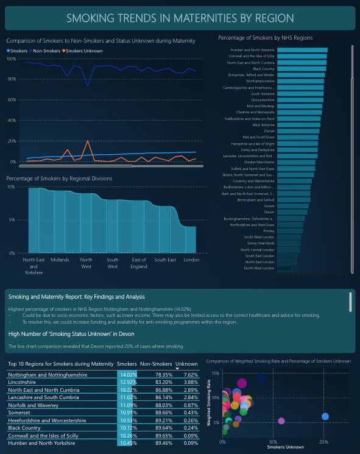
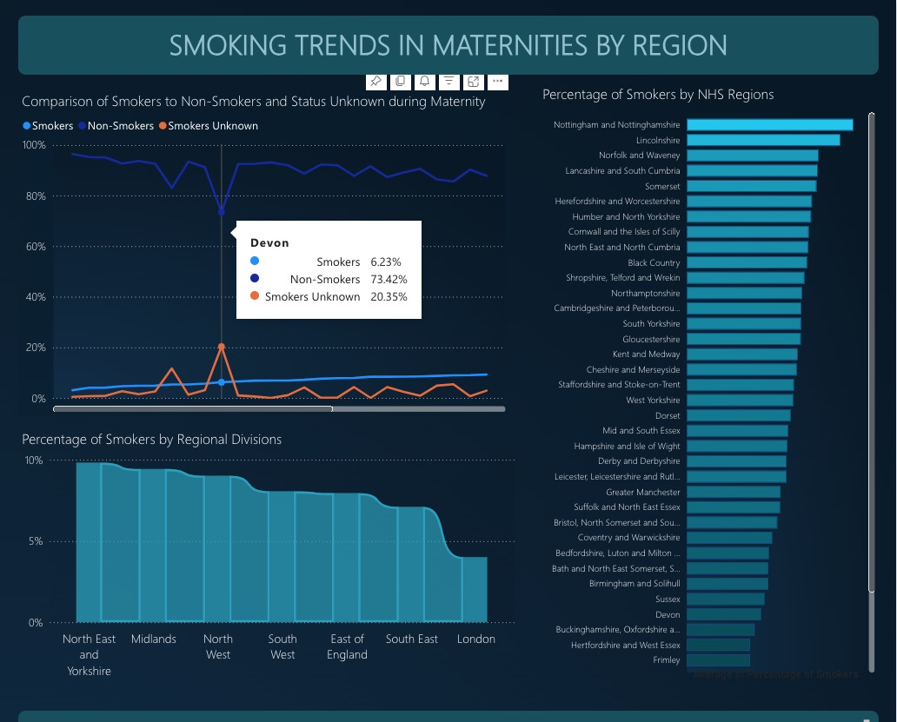
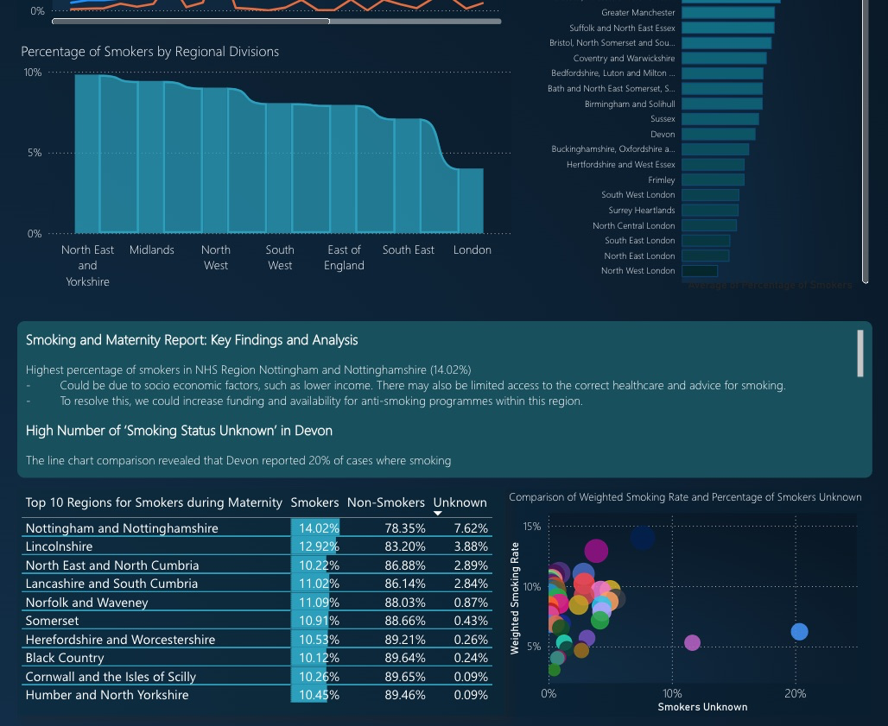

# **NHS Smoking Maternity Dashboard – Data Analysis & Policy Recommendations**  

This **Power BI dashboard** examines **smoking trends during maternity across NHS regions**, identifying key regional disparities, data inconsistencies, and areas for improvement. Using NHS data, the project provides a **comprehensive overview of smoking rates, highlights regional differences, and offers policy recommendations** to support improved maternal health outcomes.

---

## **Project Overview**  

This dashboard explores maternity smoking trends across NHS regions with the aim to:  
- ✅ **Compare regional smoking rates** and highlight disparities  
- ✅ **Identify data quality issues**, including missing or unknown smoking statuses  
- ✅ **Offer evidence-based recommendations** to reduce smoking during pregnancy  
- ✅ **Evaluate socio-economic factors** influencing regional smoking trends  

---

## **Report**  

### **Overview**  
  

### **Regional Smoking Comparisons**  
  

### **Key Findings and Recommendations**  
  

---

## 🪛 **Tools Used**  

- **Power BI** – Data modelling, visualisation, and dashboard design  
- **Excel/CSV** – Data cleaning, preprocessing, and formatting  
- **DAX** – Advanced calculations, including **Weighted Smoking Rate Analysis**  

---

## 🔬 **Key Findings**  

**Highest reported smoking rates during maternity:**  
- **Nottingham and Nottinghamshire (14.02%)**  
- **Lincolnshire (12.92%)**  
- **North East & North Cumbria (12.08%)**

**Significant proportion of 'Smoking Status Unknown':**  
- **Devon reported 20.35% unknown statuses**, indicating a need for better data quality

**Regional variation in smoking trends:**  
- **North East & Yorkshire reported the highest rates**  
- **London recorded the lowest**, suggesting more effective interventions  
- Influenced by **socio-economic and cultural factors**  

---

## **Smoking and Maternity Report: Analysis and Recommendations**  

### **1. Highest Smoking Rates – Nottingham and Nottinghamshire (14.02%)**  

**Contributing factors:**  
- High deprivation and low income levels  
- Limited access to cessation resources  
- Cultural behaviours influencing smoking  

**Recommendations:**  
- Boost local NHS funding for smoking cessation services  
- Run targeted public health campaigns  
- Improve access to nicotine replacement therapies (NRTs)  
- Integrate cessation advice into routine maternity care  

---

### **2. Data Completeness Issues – Devon**  

**Issue:**  
- 20.35% of records had unknown smoking status  

**Causes may include:**  
- Incomplete or inconsistent data entry  
- Non-disclosure due to stigma  
- Absence of standardised NHS protocols  

**Recommendations:**  
- Standardise data reporting processes  
- Train healthcare staff in effective data collection  
- Encourage open disclosure in a non-judgemental setting  
- Mandate smoking status fields in digital health records  

---

### **3. Regional Disparities – North East & Yorkshire vs. London**  

**Observations:**  
- Highest smoking rates in North East & Yorkshire  
- Lowest rates in London, suggesting more robust support systems  

**Potential causes:**  
- Higher deprivation in northern regions  
- Stronger health campaigns and support access in London  
- Regional differences in cultural attitudes  

**Recommendations:**  
- Increase public health efforts in high-risk regions  
- Provide additional support for pregnant women in deprived areas  
- Study and replicate successful London-based interventions  
- Establish a national NHS maternity smoking reduction framework  

---

## **Opportunities for Enhanced Data Science Approaches**  

**Current challenges:**  
- Missing or inconsistent smoking status data  
- No integration of socio-economic variables  
- Limited real-time monitoring  

**Future enhancements:**  
- Use machine learning to identify high-risk cases  
- Apply clustering techniques (e.g. K-Means, DBSCAN)  
- Incorporate AI-driven survey tools  
- Merge with socio-economic datasets for deeper analysis  
- Automate dashboard updates for live reporting  

---

## **Policy Impact & Financial Implications for the NHS**  

**Projected outcomes if recommendations are implemented:**  
- 10–15% reduction in smoking rates through targeted programmes  
- 5–8% improvement in data accuracy  
- 7–12% reduction via awareness campaigns  

**NHS benefits:**  
- Fewer pregnancy-related complications  
- Lower long-term costs in neonatal care  
- Improved resource allocation from better data  

**Suggested next steps:**  
- Pilot smoking reduction programmes in Nottinghamshire and the North East  
- Implement consistent data protocols across NHS trusts  
- Scale successful local strategies nationally  

---

## **Future Work and Development**  

- Refine forecasting using hybrid machine learning models  
- Analyse effectiveness of cessation programmes  
- Build real-time interactive dashboards  
- Integrate wider socio-economic indicators into analysis  

This project highlights how **data science, business intelligence, and evidence-based policy** can support **better maternal health outcomes** across the UK.  

---

**Interested in collaborating or learning more?**  
✉️ [mashasesa@gmail.com](mailto:mashasesa@gmail.com) | [LinkedIn](https://www.linkedin.com/in/mashaesa)